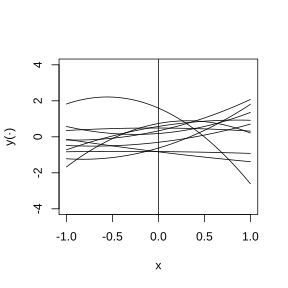

# 2 用于描述计算机模拟器输出的随机过程模型

## 2.1 介绍

回顾 $\boldsymbol{x}$ 代表计算机模拟器的通用输入，$y(\boldsymbol{x})$ 代表对应的输出。本章将介绍几类用于描述 $y(\boldsymbol{x})$ 的随机函数模型，这些模型是后续章节将要讲解的插值方法、试验设计、校准与调优方法的核心基础模块。随机函数方法之所以十分实用，原因在于：当关于输出函数的已知信息极少时，想要基于黑盒计算机模拟器的输出实现精准预测，就需要丰富多样的 $y(\boldsymbol{x})$ 模型形式。事实上，针对模拟器输出的回归均值建模，通常选用的参数形式具有较强的主观性。

尽管部分读者会将过程模型视作常见回归模型的拓展，但另一些读者则把它看作 $y(\boldsymbol{x})$ 的贝叶斯（先验）模型。可以构建该过程模型，以保证在采集数据前已知的 $y(\boldsymbol{x})$ 具备平滑性与单调性特征，因此该过程是 $y(\boldsymbol{x})$ 的先验（关于先验信息提取、模拟器模型先验分布构建的案例研究，可参考奥克利（2002）与里斯等人（2004）；更一般性的内容可参见伯杰（1985）以及奥黑根（1994））。

本书采用贝叶斯视角，因为作者认为这是在哲学层面最令人满意的方法。例如，对预测值区间估计的贝叶斯解释，可以描述给定训练数据时 $y(\boldsymbol{x})$ 的不确定性。遗憾的是，我们并非总能获取有效的先验信息。因此我们的方法并不教条：虽然过程模型决定了先验所生成函数的特性，但我们并不会刻板地信奉这些先验。我们的思路是选择灵活的先验，使其能够生成多种形式的 $y(·)$，再依靠贝叶斯机制完成预测以及其他推断过程的细节计算。

计算机实验的设计与分析并非唯一采用贝叶斯方法来处理存在测量误差、高度相关的 $y(\boldsymbol{x})$ 数据的统计学分支。会产生这类数据的学科领域包括地质统计学（马瑟龙，1963；茹尔内与于伊布雷茨，1978）、环境统计学与疾病制图（里普利，1981；克雷西，1993）、全局优化（莫库斯等人，1997）以及统计学习（黑斯蒂等人，2001）。因此，这些学科文献中探讨的诸多方法同样适用于计算机实验。

下文用 $\mathcal{X}$ 表示未知输出 $y(\boldsymbol{x})$ 的输入空间。函数 $y(\cdot)$ 可看作从随机函数（“随机过程”，或简称为“过程”）中抽取的一个样本，该随机函数记为 $Y(\cdot)$。本书讨论随机过程模型时采用实用主义视角，而非测度论视角。不过，了解下述内容有助于加深对该主题的理解：随机函数最好理解为从基本结果样本空间（记为 $\Omega$）到给定函数集合的映射，正如随机变量是从结果集合 $\Omega$ 到实数集的映射。有时，写成 $y(\boldsymbol{x})=Y(\boldsymbol{x},\omega)$（$\omega\in\Omega$）会让论述更加清晰，此时 $Y(\cdot,\omega)$ 代表从 $\mathcal{X}$ 映射到一维实数空间 $\mathbb{R}^1$ 的某一个特定函数。因此 $y(\boldsymbol{x})=Y(\boldsymbol{x},\omega)$ 被称作随机函数 $Y(\omega)$ 的一次抽取或一个实现。在讨论取自该过程的函数 $y(\boldsymbol{x})=Y(\boldsymbol{x},\omega)$ 的光滑性性质时，引入底层样本空间 $\Omega$ 就有助于厘清概念。

为向不了解随机函数概念的读者介绍这一思想，我们在引言的结尾给出一个示例，演示生成随机二次函数的简易方法。

**例 2.1**

假设区间 $[-1,+1]$ 上的 $y(x)$ 由如下机制生成：

$$
Y(x)=b_0+b_1x+b_2x^2
\tag{2.1.1}
$$

其中 $b_0$、$b_1$、$b_2$ 相互独立，且对 $i=0,1,2$，有 $b_i\sim\mathrm{N}(0,\sigma_i^2)$。由 $Y(x)$ 生成的函数易于直观理解。每一个实现 $y(\cdot)$ 都是二次函数（$\mathrm{P}\{b_2=0\}=0$），其对称轴不是 $y$ 轴（当且仅当 $b_1=0$ 时对称轴为 $y$ 轴，但 $\mathrm{P}\{b_1=0\}=0$）。该二次函数为凸函数的概率是 $1/2$，为凹函数的概率是 $1/2$（因为 $\mathrm{P}\{b_2>0\}=1/2=\mathrm{P}\{b_2<0\}$）。图 2.1 展示了当 $\sigma_0^2=\sigma_1^2=\sigma_2^2=1.0$ 时，$Y(x)$ 对应的 $10$ 组样本结果。

> **图 2.1**：在区间 $[-1,+1]$ 上对随机函数 $Y(x)=b_0+b_1x+b_2x^2$ 进行 $10$ 次抽样，其中 $b_0$、$b_1$ 和 $b_2$ 相互独立，且均服从标准正态分布 $\mathrm{N}(0,1.0)$

{width=50%}

对于任意 $x\in[-1,+1]$，由式 (2.1.1) 得到的样本均值为 $0$，即

$$
\begin{align*}
\mathrm{E}[Y(x)]&=\mathrm{E}[b_0+b_1x+b_2x^2]\\
&=\mathrm{E}[b_0]+\mathrm{E}[b_1]x+\mathrm{E}[b_2]x^2\\
&=0+0x+0x^2=0
\tag{2.1.2}
\end{align*}
$$

式 (2.1.2) 表明：对任意的 $x$，在对系数 $(b_0,b_1,b_2)$ 进行大量抽样时，$Y(x)$ 的均值为 $0$。同理，对任意 $x\in[-1,+1]$，$Y(x)$ 的方差为

$$
\begin{align*}
\text{Var}[Y(x)]&=\mathrm{E}[(b_0+b_1x+b_2x^2)(b_0+b_1x+b_2x^2)]\\
&=\sigma_0^2+\sigma_1^2x^2+\sigma_2^2x^4\ge0
\tag{2.1.3}
\end{align*}
$$

式 (2.1.2) 与式 (2.1.3) 描述的两个性质均可在图 2.1 中观察到。举例来说，仅抽取 $10$ 个函数样本，就可以从 $y(-1)$ 与 $y(+1)$ 的取值离散程度大于 $y(0)$ 取值离散程度这一现象，看出式 (2.1.3) 对应的特征。

此外，对于 $x_1,x_2\in[-1,+1]$，$Y(x_1)$ 和 $Y(x_2)$ 的取值具有相关性，可由下式看出：

$$
\begin{align*}
\text{Cov}[Y(x_1),Y(x_2)]&=\mathrm{E}[(b_0+b_1x_1+b_2x_1^2)(b_0+b_1x_2+b_2x_2^2)] \\
&=\sigma_0^2+\sigma_1^2x_1x_2+\sigma_2^2x_1^2x_2^2
\tag{2.1.4}
\end{align*}
$$

协方差式 (2.1.4) 可为正，也可为负。$Y(x_1)$ 和 $Y(x_2)$ 协方差的符号可直观解释如下：当 $x_1$ 与 $x_2$ 同为正或同为负，也就是二者位于 $y$ 轴（穿过 $x=0$ 的竖直线）同一侧时，协方差为正。直观上，对任意满足该条件的 $x_1,x_2$，在多次抽取 $(b_0,b_1,b_2)$ 的样本时，$x_1$ 和 $x_2$ 往往处于 $Y(x)$ 对称轴的同一侧，因此 $Y(x_1)$ 与 $Y(x_2)$ 会同增或同减（见图 2.1）。若 $x_1$ 和 $x_2$ 分别位于原点两侧，则式 (2.1.4) 中的中间项为负，且该项的绝对值大于正项 $\sigma_0^2$ 与 $\sigma_2^2x_1^2x_2^2$ 之和，此时协方差公式计算结果为负。直观上，一种出现该情形的条件是：$\sigma_0^2$ 较小（意味着曲线大多靠近点 $(0,0)$），$\sigma_2^2$ 较小（在 $x$ 靠近 $0$ 处曲线近似线性），且 $\sigma_1^2$ 较大。在此条件下，抽样得到的斜率会在很大的正值与很大的负值之间波动，这说明多次抽样时，$Y(x_1)$ 与 $Y(x_2)$ 的取值符号通常相反。

由于一组固定的独立正态随机变量的线性组合服从多元正态分布，因此模型 $Y(x)$ (2.1.1) 满足下述性质。对于任意 $L>1$ 以及任意选取的 $x_1,\dots,x_L\in\mathcal{X}$，向量 $\{Y(x_1),\dots,Y(x_L)\}$ 服从多元正态分布。

从描述计算机模拟器输出的角度来看，$y(\cdot)$ 的实现存在几项关键局限。第一，$Y(x)$ 仅能生成二次抽样结果。第二，当 $L\ge4$ 时，$\{Y(x_1),\dots,Y(x_L)\}$ 服从的多元正态分布是退化的。本章后续推导将提供更具灵活性的随机函数，这类函数保留了计算优势，可使 $\{Y(x_1),\dots,Y(x_L)\}$ 服从非退化多元正态分布。

本章剩余部分安排如下。2.2 – 2.4 节介绍实值输出模型。2.2 节回顾常用的高斯过程（GP）模型类别，2.3 节讨论高斯过程模型的部分非平稳扩展形式，2.4 节介绍适用于同时包含定量与定性输入的模拟器模型。2.5 节描述可生成多变量或函数型输出的模拟器模型。
