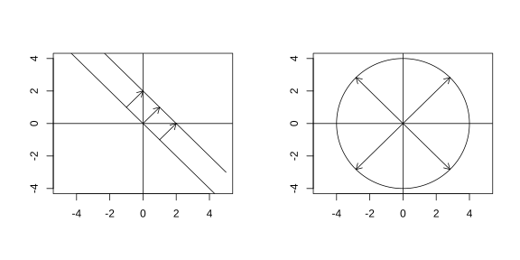
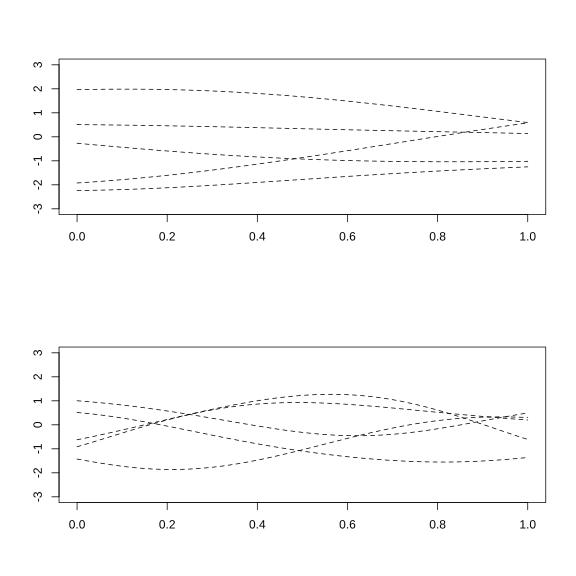
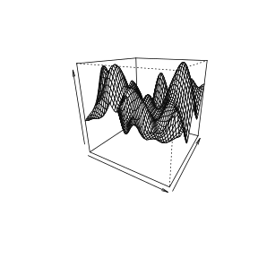

## 2.2 实值输出的高斯过程模型

### 2.2.1 介绍

由于具备良好的解析可处理性，在计算机实验相关文献中，用于生成函数样本的最常用 $Y(\boldsymbol{x})$ 过程为高斯过程模型，也称作高斯随机函数模型。因此本节重点介绍高斯过程模型，不过需要说明的是，文中引入的部分概念同样适用于更一般的随机函数模型。

> **定义**：假设 $\mathcal{X}$ 是 $\mathbb{R}^d$ 中具有正 $d$ 维体积的固定子集；若对任意 $L\ge1$ 以及 $\mathcal{X}$ 中任意选取的 $\boldsymbol{x}_1,\dots,\boldsymbol{x}_L$，向量 $\{Y(\boldsymbol{x}_1),\dots,Y(\boldsymbol{x}_L)\}$ 服从多元正态分布，则称 $Y(\boldsymbol{x}),\boldsymbol{x}\in\mathcal{X}$ 为高斯过程（GP）。

任意高斯过程由其均值函数 $\mu(\boldsymbol{x})\equiv\mathrm{E}[Y(\boldsymbol{x})],\boldsymbol{x}\in\mathcal{X}$，以及协方差函数

$$
C(\boldsymbol{x}_1,\boldsymbol{x}_2)\equiv\mathrm{Cov}[Y(\boldsymbol{x}_1),Y(\boldsymbol{x}_2)]
\tag{2.2.1}
$$

（其中 $\boldsymbol{x}_1,\boldsymbol{x}_2\in\mathcal{X}$）唯一确定。为和时间序列分析中的术语保持一致，部分文献将 $C(\cdot,\cdot)$ 称为“自协方差”函数。

实际应用中所使用的高斯过程是非奇异的，这意味着无论如何选取输入，对应的多元正态分布的协方差矩阵都是非奇异的。非奇异多元正态分布的优势在于：给定其余 $Y(\boldsymbol{x}_j)$ 时，可以便捷计算一个（或多个）$Y(\boldsymbol{x}_i)$ 变量的条件分布。第 3 章所使用的经验最优线性无偏预测方法需要已知这些条件均值与条件方差。此外，从最常用的高斯过程中抽样得到的样本，其形态范围比例 2.1 中由二次方程生成的结果更为丰富。这类高斯过程还允许建模者控制 $y(\boldsymbol{x})$ 抽样函数的光滑性；在上述大多数科学应用场景中，通常会掌握关于 $y(\cdot)$ 光滑性的部分信息，哪怕仅仅知道它是输入的连续函数。

在介绍具体高斯过程模型之前，需要说明两个技术问题。第一个问题与如下事实有关：高斯过程模型由其有限维分布定义。与之不同，连续性、可微性这类光滑性性质依赖极限运算，因此需要了解样本在一段取值区间内是否具备预期形态。换言之，作为 $\boldsymbol{x}$ 的函数，$y(\boldsymbol{x})$ 的连续性与可微性属于样本轨道性质，即对于固定的 $\omega$，把 $y(\boldsymbol{x})=Y(\boldsymbol{x},\omega)$ 看作关于 $\boldsymbol{x}$ 的函数。杜布（1953）提出了随机过程的可分性这一性质，该性质保证函数样本的轨道性质由过程的有限维分布决定。可分性确切含义的细节不在本书讨论范围内，感兴趣的读者可以参阅阿德勒（1981）。对本书而言，只需了解：对定义在集合 $\mathcal{X}$ 上的任意随机函数 $Y(\cdot)$，都存在定义在 $\mathcal{X}$ 上与之等价的可分随机函数 $Y^{\mathrm{s}}(\cdot)$，使得对所有 $\boldsymbol{x}\in\mathcal{X}$，满足

$$
\mathrm{P}\{Y(\boldsymbol{x})=Y^{\mathrm{s}}(\boldsymbol{x})\}=1
$$

本书通篇假定选取的高斯过程模型均满足可分性。

第二个技术问题属于统计学范畴。经典的频率派统计方法基于从总体中抽取的样本对总体进行推断，需要着重强调的是，每一次抽样对应总体中一个不同的 $\omega$ 或者个体。随后人们设计统计方法，使其在假设下重复应用于同一总体时具备特定性质，例如预测区间的覆盖概率，描述的是该统计方法在目标总体上重复使用时的表现。与之不同，计算机模拟器 $n$ 次运行得到的“训练数据”$y(\boldsymbol{x}_1),\dots,y(\boldsymbol{x}_n)$，应当被视作对应单个 $\omega$ 的 $y(\boldsymbol{x})=Y(\boldsymbol{x},\omega)$ 取值。因此训练数据提供的是关于单个函数 $Y(\boldsymbol{x},\omega)$ 的部分信息，即该函数在 $\boldsymbol{x}_1,\dots,\boldsymbol{x}_n$ 处的取值，而非由 $n$ 个不同 $\omega$ 所对应的 $n$ 个随机变量的观测值。一般而言，我们未必能够从来源于单个 $\omega$ 的数据，对由 $\omega$ 定义的总体量开展推断。过程的遍历性是一种性质，允许基于单次抽取的 $\omega$ ，对由 $\omega$ 定义的量开展有效的频率派统计推断（若想从统计学角度了解遍历性，可参见克雷斯西（1993），第 52 – 58 页以及文中列出的其他参考文献）。该概念的技术细节超出本书讨论范围。不过，下文将要定义的具备“（强）平稳性”的高斯过程，在下面给出的温和条件下具有遍历性；本书后续内容将仅针对这类高斯过程展开讨论。

> **定义**：若对任意 $\boldsymbol{h}\in\mathbb{R}^d$、任意 $L\ge1$ 以及 $\mathcal{X}$ 中满足 $\boldsymbol{x}_1+\boldsymbol{h},\dots,\boldsymbol{x}_L+\boldsymbol{h}\in\mathcal{X}$ 的任意 $\boldsymbol{x}_1,\dots,\boldsymbol{x}_L$，$\{Y(\boldsymbol{x}_1),\dots,Y(\boldsymbol{x}_L)\}$ 与 $\{Y(\boldsymbol{x}_1+\boldsymbol{h}),\dots,Y(\boldsymbol{x}_L+\boldsymbol{h})\}$ 具有相同的分布，则称过程 $Y(\cdot)$ 是（强）平稳的。

将其应用于高斯过程时，$Y(\cdot)$ 的平稳性等价于：对于任意 $L\ge1$ 以及 $\boldsymbol{x}_1,\dots,\boldsymbol{x}_L$，$\{Y(\boldsymbol{x}_1),\dots,Y(\boldsymbol{x}_L)\}$ 与 $\{Y(\boldsymbol{x}_1+\boldsymbol{h}),\dots,Y(\boldsymbol{x}_L+\boldsymbol{h})\}$ 具有相同的均值向量与相同的协方差矩阵。特别地，高斯过程在所有 $\boldsymbol{x}$ 处必须具有相同的边缘分布（取 $L=1$）；其均值和方差都必须为常数。此外，不难证明平稳高斯过程的协方差一定满足：

$$
\mathrm{Cov}[Y(\boldsymbol{x}_1),Y(\boldsymbol{x}_2)]=C(\boldsymbol{x}_1-\boldsymbol{x}_2)
\tag{2.2.2}
$$

其中函数 $C(\cdot)$ 被称为该过程的协方差函数。这是对式 (2.2.1) 中符号的轻微误用，因为式 (2.2.1) 中针对一般高斯过程定义的函数 $C(\boldsymbol{x}_1,\boldsymbol{x}_2)$ 不一定依赖于差值 $\boldsymbol{x}_1-\boldsymbol{x}_2$，而平稳高斯过程的协方差仅由输入之间的差值决定。

平稳过程 $Y(\boldsymbol{x})$ 的（常数）方差可以通过其协方差函数表示为 $\mathrm{Var}[Y(\boldsymbol{x})]=\mathrm{Cov}[Y(\boldsymbol{x}),Y(\boldsymbol{x})]=C(\boldsymbol{0})$。结合以上两点，可得到平稳过程 $Y(\boldsymbol{x})$ 的相关系数表达式：

$$
\mathrm{Cor}[Y(\boldsymbol{x}_1),Y(\boldsymbol{x}_2)]=C(\boldsymbol{x}_1-\boldsymbol{x}_2)/C(\boldsymbol{0})
$$

式 (2.2.2) 表明：只要点对 $\boldsymbol{x}_1$ 和 $\boldsymbol{x}_2$ 的方向相同、点间距离相等，则它们的协方差就相等。例如，图 2.2 左侧面板中的三组首尾点对，就拥有相同的协方差。

> **图 2.2**：左侧面板：对于平稳过程，每个箭头的尖端与尾端具有相同的协方差。右侧面板：对于各向同性过程，原点和圆上所有点具有相同的相关性

{width=100%}

图 2.3 展示了从两个不同的平稳随机过程 $Y(\boldsymbol{x})$ 中抽取 5 个样本的随机相似性；$y(\boldsymbol{x})$ 在任意给定长度子区间上的特征行为，与在其他任意同长度且互不重叠的子区间上的行为相同。需要提醒的是，读者应当注意：从视觉上看，很多 $y(\boldsymbol{x})$ 看上去并不“符合”平稳 $Y(\boldsymbol{x})$ 模型。例如，图 2.4 中的 $y(x_1,x_2)$ 在 $(x_1,x_2)$ 空间的边缘区域表现出的特性，和其在输入空间中心区域的表现存在差异。

> **图 2.3**：来自两个平稳过程各自的五组抽样结果

{width=50%}

> **图 2.4**：一个函数 $y(x_1,x_2)$，从直观上看与平稳模型不一致

{width=50%}

平稳高斯过程 $Y(\boldsymbol{x})$ 的协方差函数为 $C(\boldsymbol{h})$，当 $\boldsymbol{h}\to\infty$ 时，若 $C(\boldsymbol{h})\to0$，则该过程具有遍历性（阿德勒，1981，第 145 页）。下文给出的相关函数示例均满足该条件。

为保证内容完整，我们对随机可重复性（即平稳性）的讨论，将通过介绍一种更强形式的平稳性来收尾。该平稳性在空间统计应用中经常被假定，但在计算机仿真器输出建模中很少使用。假设在对输入 $\boldsymbol{x}$ 进行变换之后，$Y(\boldsymbol{x})$ 拥有常数均值，且协方差满足如下形式：

$$
\mathrm{Cov}[Y(\boldsymbol{x}_1),Y(\boldsymbol{x}_2)]=C(\|\boldsymbol{x}_1-\boldsymbol{x}_2\|_2)
$$

其中 $\|\boldsymbol{h}\|_2=(\sum_i h_i^2)^{1/2}$ 为欧氏距离；满足该性质的过程称为各向同性过程。对于各向同性模型，任意两点 $\boldsymbol{x}_1$ 和 $\boldsymbol{x}_2$，只要两点间距离相同，则无论两点的方位如何，协方差（以及相关系数）都相等。例如，对于各向同性的 $Y(\boldsymbol{x})$，原点与图 2.2 右侧面板中圆周上所有点之间的相关系数都相同。由于仿真器模型的输入通常采用不同量纲进行度量，各向同性模型很少被用于描述仿真器输出。

后续章节会偶尔探讨过程模型 $Y(\cdot)$，这类模型仅对矩做假设，而非对分布进行假设（因此应视作非参数模型）。针对计算机实验，此类模型中最重要的是二阶平稳模型。若一个过程 $Y(\boldsymbol{x})$ 的均值与方差均为常数，且其协方差函数满足式 (2.2.2)，则该过程为二阶平稳过程；该模型不对任意单个输入或有限输入集合下 $Y(\boldsymbol{x})$ 的联合分布做任何假设。

现有文献中已采用多种方法改进随机函数建模，同时保留平稳性带来的部分理论简化特性。其中最简单的方法是：令生成 $y(\boldsymbol{x})$ 的随机过程均值以回归方程的形式依赖于 $\boldsymbol{x}$，并假设残差变化服从平稳高斯过程。对应的过程表达式为

$$
Y(\boldsymbol{x})=\sum_{j=1}^{p}f_j(\boldsymbol{x})\beta_j+Z(\boldsymbol{x})=\boldsymbol{f}'(\boldsymbol{x})\boldsymbol{\beta}+Z(\boldsymbol{x})
\tag{2.2.3}
$$

式中 $f_1(\cdot),\dots,f_p(\cdot)$ 为已知回归函数，$\boldsymbol{\beta}=(\beta_1,\dots,\beta_p)'$ 是未知回归系数向量，$Z(\cdot)$ 为定义在集合 $\mathcal{X}$ 上的零均值平稳高斯过程。直观来看，$\boldsymbol{f}'(\boldsymbol{x})\boldsymbol{\beta}$ 项描述 $\boldsymbol{x}$ 对应的长期趋势，而 $Z(\boldsymbol{x})$ 用于刻画偏离该长期趋势的局部波动。

当然，模型 $Y(\cdot)$ (2.2.3) 是非平稳的。针对无法由式 (2.2.3) 抽样得到的 $y(\boldsymbol{x})$，学界已开发出大量其他非平稳模型。2.3 节将简要回顾其中部分相关文献。
