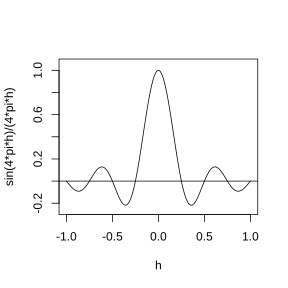

### 2.2.2 高斯过程模型的若干相关函数

本小节重点讨论式 (2.2.3) 中非平稳 $Y(\boldsymbol{x})$ 模型引入的高斯过程，即 $Z(\cdot)$。再次说明，$Z(\cdot)$ 是均值为零的平稳过程，因为所有非零均值项都已纳入回归函数。因此 $Z(\cdot)$ 完全由其协方差函数 $C(\cdot)$ 确定，该协方差函数的定义见式 (2.2.2)。

在许多应用场景中，分别描述过程方差与过程相关函数会更加方便。对于具有有限协方差函数 $C(\cdot)$ 的平稳高斯过程 $Z(\boldsymbol{x})$，其过程方差为 $\sigma_Z^2\equiv C(\boldsymbol{0})$；若 $Z(\boldsymbol{x})$ 是非退化的，即满足 $C(\boldsymbol{0})=\sigma_Z^2>0$，则过程相关函数定义为：对于任意的 $\boldsymbol{h}\in\mathbb{R}^d$，都有

$$
R(\boldsymbol{h})=C(\boldsymbol{h})/\sigma_Z^2
$$

同样在 $\sigma_Z^2>0$ 的前提下，有时会采用过程精度对过程方差进行参数化，过程精度定义为 $\lambda_Z=1/\sigma_Z^2$。

平稳高斯过程的有效协方差函数与相关函数在满足 $C(\boldsymbol{0})>0$ 的前提下，需要具备哪些性质？首先，根据定义可得 $R(\boldsymbol{0})=1$。由于 $\mathrm{Cov}[Y(\boldsymbol{x}+h),Y(\boldsymbol{x})]=\mathrm{Cov}[Y(\boldsymbol{x}),Y(\boldsymbol{x}+\boldsymbol{h})]$，协方差函数和相关函数都必须关于原点对称，即：

$$
C(\boldsymbol{h})=C(-\boldsymbol{h}),\quad R(\boldsymbol{h})=R(-\boldsymbol{h})
\tag{2.2.4}
$$

$C(\cdot)$ 与 $R(\cdot)$ 都必须是半正定函数；以 $R(\cdot)$ 来表述，即对任意 $L\ge1$、任意实数 $w_1,\dots,w_L$ 以及定义域 $\mathcal{X}$ 内任意输入 $\boldsymbol{x}_1,\dots,\boldsymbol{x}_L$，有：

$$
\sum_{i=1}^{L}\sum_{j=1}^{L}w_iw_jR(\boldsymbol{x}_i-\boldsymbol{x}_j)\ge0
\tag{2.2.5}
$$

对于有效的 $R(\cdot)$（$C(\cdot)$），式 (2.2.5) 的求和结果必须非负，原因是该式左侧为 $\sum_{i=1}^{L}w_iY(\boldsymbol{x}_i)$ 的（缩放后）方差。若对任意 $L\ge1$、$\mathcal{X}$ 内任意 $\boldsymbol{x}_1,\dots,\boldsymbol{x}_L$ 以及任意非零 $(w_1,\dots,w_L)$，式 (2.2.5) 严格大于 $0$，则称相关函数 $R(\cdot)$ 为正定函数。

如何构造有效的相关（协方差）函数？所有满足 $R(\boldsymbol{0})=1$ 以及对称性条件 (2.2.4)、(2.2.5) 的函数都是有效的相关函数。遗憾的是，仅依靠这些性质并不能提供构造相关函数的系统性方法。尽管关于如何确定有效的平稳相关函数形式的一般性研究超出了本书范畴，但该问题有一个表述相对简洁的结论。博赫纳（1955）证明：

$$
R(\boldsymbol{h})=\int_{\mathbb{R}^d}\cos(\boldsymbol{h}'\boldsymbol{w})f(\boldsymbol{w})\mathrm{d}\boldsymbol{w}
\tag{2.2.6}
$$

若 $f(\boldsymbol{w})$ 是 $\mathbb{R}^d$ 上的对称密度，即对任意 $\boldsymbol{w}\in\mathbb{R}^d$ 都有 $f(\boldsymbol{w})=f(-\boldsymbol{w})$，则式 (2.2.6) 中的 $R(\boldsymbol{h})$ 为有效相关函数。式 (2.2.6) 中的 $f(\boldsymbol{w})$ 称为与 $R(\boldsymbol{h})$ 对应的谱密度。

不难证明，由式 (2.2.6) 构造得到的函数 $R(\boldsymbol{h})$ 满足 $R(\boldsymbol{0})=1$ 以及性质 (2.2.4) 和 (2.2.5)。例如：

$$
R(\boldsymbol{0})=\int_{\mathbb{R}^d}\cos(0)f(\boldsymbol{w})\mathrm{d}\boldsymbol{w}=1
$$

因为 $f(\boldsymbol{w})$ 是密度函数。对称性 (2.2.4) 成立，是由于对任意实数 $x$ 都有 $\cos(-x)=\cos(x)$。半正定性 (2.2.5) 成立，原因是：对任意 $L\ge1$，任意实数 $w_1,\dots,w_L$ 以及任意 $\boldsymbol{x}_1,\dots,\boldsymbol{x}_L$，

$$
\begin{aligned}
&\quad\sum_{i=1}^{L}\sum_{j=1}^{L}w_iw_jR(\boldsymbol{x}_i-\boldsymbol{x}_j)\\
&=\int_{\mathbb{R}^d}\sum_{i=1}^{L}\sum_{j=1}^{L}w_iw_j\cos(\boldsymbol{x}_i'\boldsymbol{w}-\boldsymbol{x}_j'\boldsymbol{w})f(\boldsymbol{w})\mathrm{d}\boldsymbol{w}\\
&=\int_{\mathbb{R}^d}\sum_{i=1}^{L}\sum_{j=1}^{L}w_iw_j\{\cos(\boldsymbol{x}_i'\boldsymbol{w})\cos(\boldsymbol{x}_j'\boldsymbol{w})+\sin(\boldsymbol{x}_i'\boldsymbol{w})\sin(\boldsymbol{x}_j'\boldsymbol{w})\}f(\boldsymbol{w})\mathrm{d}\boldsymbol{w}\\
&=\int_{\mathbb{R}^d}\left\{\left(\sum_{i=1}^{L}w_i\cos(\boldsymbol{x}_i'\boldsymbol{w})\right)^2+\left(\sum_{i=1}^{L}w_i\sin(\boldsymbol{x}_i'\boldsymbol{w})\right)^2\right\}f(\boldsymbol{w})\mathrm{d}\boldsymbol{w}\\
&\ge0
\end{aligned}
$$

综上，构造相关函数的一种方法是在 $\mathbb{R}^d$ 上选取对称密度函数 $f(\boldsymbol{w})$，并利用式 (2.2.6) 计算 $R(\boldsymbol{h})$。由 $R(\boldsymbol{h})$ 可得到具有指定过程方差 $\sigma_Z^2>0$ 和谱密度 $f(\boldsymbol{w})$ 的有效协方差函数：

$$
C(\boldsymbol{h})=\sigma_Z^2R(\boldsymbol{h})
$$

**例 2.2**

式 (2.2.6) 最简明的应用情形当属 $d=1$，且 $f(w)$ 为对称区间上的均匀密度。对给定的 $\xi>0$，取区间为 $(-1/\xi,+1/\xi)$。此时谱密度为

$$
f(w)=\begin{cases}\xi/2,&-1/\xi<w<1/\xi\\
0,&\text{其他}\end{cases}
$$

对应的相关函数为

$$
R(h|\xi)=\int_{-1/\xi}^{+1/\xi}\frac{\xi}{2}\cos(hw)\,\mathrm{d}w=\begin{cases}\frac{\sin(h/\xi)}{h/\xi},&h\neq0\\
1,&h=0\end{cases}
$$

该相关函数含有尺度参数 $\xi$。图 2.5 绘制了区间 $[-1,+1]$ 上 $R(h|\xi=1/4\pi)$ 的曲线，可见该相关模型可用于刻画同时存在正相关与负相关的随机过程。

> **图 2.5**：相关函数 $R(h|\xi)=\sin(h/\xi)/(h/\xi)$，在区间 $[−1,+1]$ 内，$\xi=1/4\pi$

{width=50%}

给定一组已知的协方差（相关）函数，还有其他一些工具可用于构造协方差（相关）函数。假设 $C_1(\cdot)$ 和 $C_2(\cdot)$ 是合法的协方差函数，则它们的和与积，即

$$
C_1(\cdot)+C_2(\cdot),\quad C_1(\cdot)\times C_2(\cdot)
$$

同样是合法的协方差函数。直观来看，$C_1(\cdot)+C_2(\cdot)$ 是两个独立过程之和对应的协方差函数，其中一个过程的协方差函数为 $C_1(\cdot)$，另一个的协方差函数为 $C_2(\cdot)$。与之类似，$C_1(\cdot)\times C_2(\cdot)$ 是两个独立零均值高斯过程乘积对应的协方差函数，二者的协方差分别为 $C_1(\cdot)$ 和 $C_2(\cdot)$。

两个有效相关函数 $R_1(\cdot)$ 与 $R_2(\cdot)$ 的乘积是一个有效相关函数，但二者之和却不是（注意 $R_1(\boldsymbol{0})+R_2(\boldsymbol{0})=2$，这对于相关函数来说是不可能成立的）。不过需要注意，两个有效相关函数的凸组合仍是有效相关函数。由一维边缘相关函数相乘得到的相关函数有时被称为可分离相关函数（请勿与 2.2.1 节中关于过程可分离性的讨论相混淆）。

本小节最后介绍文献中用于定义平稳高斯随机过程的几类相关函数（另可参见焦耐尔、惠布雷茨（1978）、米切尔等人（1990）、克雷斯西（1993）、维基亚（1988）以及斯坦（1999））。
