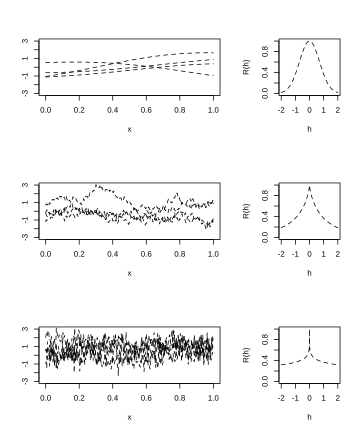
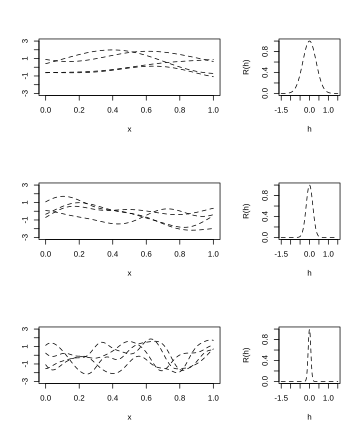
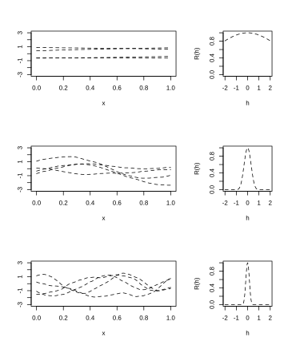

### 2.2.3 利用相关函数定义具备指定光滑特性的高斯过程

本小节讨论式 (2.2.3) 中

$$
Y(\boldsymbol{x})=\boldsymbol{f}'(\boldsymbol{x})\boldsymbol{\beta}+Z(\boldsymbol{x})
$$

实现的光滑性性质。该讨论可拆分为对回归项 $\boldsymbol{f}'(\boldsymbol{x})\boldsymbol{\beta}$ 的光滑性分析，以及平稳高斯过程 $Z(\cdot)$ 样本的光滑性分析。回归项连续性与可微性的判定较为直观，只需运用基础微积分知识。

本节余下部分将讨论 $Z(\cdot)$ 实现的性质，这些性质与 $Z(\cdot)$ 的协方差函数（记为 $C(\cdot)$）相关。出于推导简便性，我们先从均方（MS）连续性入手展开分析。均方性质描述的是样本路径上的平均表现，而非单条样本路径的性质；需要注意的是，在对计算机模拟器输出进行建模时，后者更受关注。

> **定义**：设 $W(\cdot)$ 为定义在输入域 $\mathcal{X}$ 上的平稳过程，且具有正的有限二阶矩；若 $$\lim_{\boldsymbol{x}\to \boldsymbol{x}_0}\mathrm{E}[\{W(\boldsymbol{x})-W(\boldsymbol{x}_0)\}^2]=0$$ 则称 $W(\cdot)$ 在点 $\boldsymbol{x}_0\in\mathcal{X}$ 处均方连续。若该过程在 $\mathcal{X}$ 上的每一点 $\boldsymbol{x}_0$ 处均均方连续，则称此过程在 $\mathcal{X}$ 上均方连续。

假设 $C(\cdot)$ 是平稳过程 $Z(\cdot)$ 的协方差函数，则

$$
\mathrm{E}[\{Z(\boldsymbol{x})−Z(\boldsymbol{x}_0)\}^2]=2\{C(\boldsymbol{0})−C(\boldsymbol{x}−\boldsymbol{x}_0)\}
\tag{2.2.15}
$$

式 (2.2.15) 的右端表明：若 $C(\boldsymbol{h})$ 在原点处连续，则 $Z(\cdot)$ 在 $\boldsymbol{x}_0$ 处均方连续；事实上，只要 $C(\boldsymbol{h})$ 在原点处连续，$Z(\boldsymbol{x})$ 在所有 $\boldsymbol{x}_0\in\mathcal{X}$ 上都均方连续。

假设 $Z(\boldsymbol{x})$ 的方差为正，则其相关函数满足 $C(\boldsymbol{0})=\sigma_Z^2>0$。此时，当 $\boldsymbol{h}\to\boldsymbol{0}$ 时 $C(\boldsymbol{h})\to C(\boldsymbol{0})=\sigma_Z^2>0$ 这一连续性条件，等价于要求相关函数满足：

$$
R(\boldsymbol{h})=C(\boldsymbol{h})/\sigma_Z^2\to1,\quad\boldsymbol{h}\to\boldsymbol{0}
\tag{2.2.16}
$$

2.2.2 节列出的所有相关函数在原点处均连续。

现在考虑本节的主要目标：确定过程所需满足的条件，以保证 $Z(x)$ 过程的样本实现 $z(x)$ 具备目标“光滑性”性质（概率为 $1$）。设“$Q$”代表该期望性质。目标为

$$
P\{\omega:Z(\cdot,\omega)\;\text{具有性质}\;Q\}=1
$$

这类性质称为样本取值的几乎必然性质。

作为这类条件的第一个例子，阿德勒（1981）（第 60 页）证明：若在保证均方连续的连续性条件 (2.2.16) 基础上增加一项弱约束，则平稳高斯过程的样本路径几乎必然连续。用文字表述：当 $\boldsymbol{h}\to\boldsymbol{0}$ 时，若 $R(\boldsymbol{h})$ 足够快地收敛至 $1$，那么平稳高斯过程的样本实现满足几乎必然连续性；也就是存在 $c>0$、$\epsilon>0$ 以及 $\delta<1$，使得对所有满足 $\|\boldsymbol{h}\|_2<\delta$ 的 $\boldsymbol{h}$，有

$$
1-R(\boldsymbol{h})\leq\frac{c}{|\ln(\|\boldsymbol{h}\|_2)|^{1+\epsilon}}
\tag{2.2.17}
$$

式中 $\|\cdot\|_2$ 代表欧氏距离。式 (2.2.17) 是比 $R(\boldsymbol{h})\to1$ 更强的条件，因为当 $\boldsymbol{h}\to0$ 时，因子 $|\ln(\|\boldsymbol{h}\|_2)|^{1+\epsilon}$ 趋向正无穷。

再举一例，考虑平稳过程 $Z(\boldsymbol{x})$ 样本轨道的几乎处处可微性；一条样本轨道是函数 $Z(\boldsymbol{x},\omega)$，其中 $\boldsymbol{x}\in\mathbb{R}^d$，对应 $\omega\in\Omega$。假设对 $j=1,\dots,d$，$Z(\boldsymbol{x},\omega)$ 在 $\boldsymbol{x}_0\in\mathcal{X}$ 处存在第 $j$ 阶偏导数，即

$$
\nabla_jZ(\boldsymbol{x}_0,\omega)=\lim_{\delta\to0}\frac{Z(\boldsymbol{x}_0+\boldsymbol{e}_j\delta,\omega)-Z(\boldsymbol{x}_0,\omega)}{\delta}
$$

存在，式中 $\boldsymbol{e}_j$ 代表第 $j$ 个方向上的单位向量。下文将给出协方差函数需要满足的条件，以保证样本轨道几乎处处可微。为说明该条件的由来，可以观察下面的启发式推导，该推导给出过程 $Z(\boldsymbol{x})$ 在输入 $\boldsymbol{x}_1,\boldsymbol{x}_2\in\mathcal{X}$ 处割线斜率的协方差。若 $C(\cdot)$ 的二阶偏导数存在，则

$$
\begin{aligned}
&\quad\mathrm{Cov}\left[\frac{1}{\delta_1}\{Z(\boldsymbol{x}_1+\boldsymbol{e}_j\delta_1)-Z(\boldsymbol{x}_1)\},\frac{1}{\delta_2}\{Z(\boldsymbol{x}_2+\boldsymbol{e}_j\delta_2)-Z(\boldsymbol{x}_2)\}\right]\\
&=\frac{1}{\delta_1\delta_2}[C\{\boldsymbol{x}_1-\boldsymbol{x}_2+\boldsymbol{e}_j(\delta_1-\delta_2)\}-C\{\boldsymbol{x}_1-\boldsymbol{x}_2+\boldsymbol{e}_j\delta_1\}\\
&\quad-C\{\boldsymbol{x}_1-\boldsymbol{x}_2-\boldsymbol{e}_j\delta_2\}+C\{\boldsymbol{x}_1-\boldsymbol{x}_2\}]\\
&\to-\left.\frac{\partial^2C\{\boldsymbol{h}\}}{\partial h_j^2}\right|_{\boldsymbol{h}=\boldsymbol{x}_1-\boldsymbol{x}_2}
\end{aligned}
$$

当 $\delta_1,\delta_2\to0$ 时成立。该推导表明 $Z(\cdot)$ 的偏导数与协方差函数 $C(\boldsymbol{h})$ 之间存在关联。事实上，平稳高斯过程 $Z(\boldsymbol{x})$ 几乎处处存在第 $j$ 阶偏导数（$j=1,\dots,d$）的充分条件为：

$$
C_j^{(2)}(\boldsymbol{h})\equiv\frac{\partial^2C(\boldsymbol{h})}{\partial h_j^2}
$$

存在且连续，$C_j^{(2)}(\boldsymbol{0})\neq0$，并且 $R_j^{(2)}(\boldsymbol{h})\equiv C_j^{(2)}(\boldsymbol{h})/C_j^{(2)}(\boldsymbol{0})$ 满足式 (2.2.17)。此时 $-C_j^{(2)}(\boldsymbol{h})$ 是过程 $\nabla_jZ(\boldsymbol{x})$ 的协方差函数，$R_j^{(2)}(\boldsymbol{h})$ 是其相关函数。可以用同样思路迭代构造条件，用以保证 $Z(\cdot)$ 更高阶导数存在。

本节最后举例说明调整前文介绍的两类相关函数族参数所产生的影响。我们将基于定义在区间 $[0,1]$ 上、零均值且单位方差的平稳高斯过程，采用指定的相关函数族进行抽样，以此展示上述参数带来的效果。当然，若引入回归项 $\boldsymbol{f}'(x)\boldsymbol{\beta}$，可以进一步提升可建模函数 $y(\boldsymbol{x})$ 的类型灵活性，但本文不对回归项的使用进行演示。

**例 2.4**（续：幂指数相关函数）

图 2.6 与图 2.7 展示了由幂指数相关函数 (2.2.10) 生成的 $z(x)$ 样本。图 2.6 固定速率参数 $\xi=1.0$；该图展示改变幂次 $p$ 对 $z(x)$ 样本产生的影响。图 2.7 固定 $p=2$ ；该图展示改变 $\xi$ 对 $z(x)$ 样本产生的影响。

> **图 2.6**：左列：幂指数相关函数 (2.2.10) 中幂次 $p$ 取不同值，对零均值、单位方差且固定 $\xi\equiv1.0$ 的高斯过程的四组采样结果产生的影响；右列：$C(h)=\exp\{-|h|^p\}$，取值范围 $-2.0\le h\le+2.0$。其中第一行 $p=2.0$，第二行 $p=0.75$，第三行 $p=0.20$

{width=100%}

> **图 2.7**：左列：幂指数相关函数 (2.2.10) 中变化率参数 $\xi$ 对零均值、单位方差高斯过程的四组采样结果产生的影响，其中固定 $p\equiv2.0$；右列：$C(h)=\exp\{-\xi h^2\}$，取值范围 $-1.5\le h\le+1.5$。其中 $\xi=4$（第一行），$\xi=16$（第二行），$\xi=100$（第三行）。

{width=100%}

图 2.6 最下面两行对应的幂次 $p<2$；前文已经说明，当 $p<2$ 时，样本路径 $z(x)=Z(x,\omega)$ 不可微，这也解释了这些 $z(x)$ 呈现出“起伏波动”的形态。第一行的 $z(x)$ 绘图结果对应 $p=2.0$，它们是无穷次可微的。实际上，图 2.6 第一行中的 $z(x)$ 样本曲线非常接近于均值为 $0$ 的过程。

图 2.7 表明，当 $p=2.0$ 时，$z(x)$ 的局部极大值与极小值数量由速率参数 $\xi$ 控制。随着 $\xi$ 增大，每一组固定输入对之间的相关性下降，$z(x)$ 的局部极大值数量增多。实际上，当 $\xi\to+\infty$ 时，随机过程 $Z(x)$ 的波动特性会更接近白噪声。图 2.7 中展示的该现象最极端的情况是底行，对应 $\xi=100.0$。

**例 2.6**（续：三次相关函数）

回顾三次相关（以及协方差）函数 (2.2.12) 是二阶连续可微的。因此，由带三次相关函数的高斯过程生成的 $z(x)$ 是连续且可微的。图 2.8 展示了该高斯过程在不同 $\psi$ 取值下的样本实现。当尺度参数 $\psi$ 减小时，满足 $R(h)=0$ 的区域扩大，对应的样本路径会更接近白噪声，也就是具有独立同分布的高斯分量。当 $\psi$ 增大时，在更大的 $h$ 区间内 $R(h)$ 趋近于 $1.0$（见上图第一行），意味着 $z(x)$ 在更大的 $x$ 区间上取值几乎同步变化，样本曲线也会更加平缓。

> **图 2.8**：左列：三次相关函数 (2.2.12) 中尺度参数 $\psi$ 取不同值时，对零均值、单位方差高斯过程的四组采样结果产生的影响；右列：三次相关函数 $R(h\mid\psi)$，取值范围 $-2.0\le h\le+2.0$。其中 $\psi=10.0$（第一行），$\psi=1.0$（中间行），$\psi=0.5$（最下方一行）

{width=100%}
