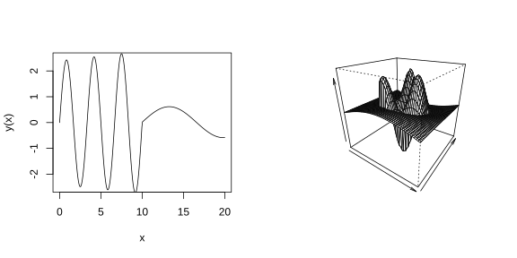
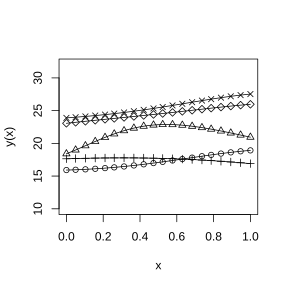

### 2.3.1 提升高斯过程模型的灵活性

本节概述了文献中提出的若干方法，用于替换回归加平稳高斯过程模型：

$$
Y(\boldsymbol{x})=\boldsymbol{f}'(\boldsymbol{x})\boldsymbol{\beta}+Z(\boldsymbol{x})
\tag{2.3.1}
$$

通过采用更具灵活性的 $Y(\boldsymbol{x})$，构造范围更广的 $y(\boldsymbol{x})$ 模型（$Y(\boldsymbol{x})$ 的详细说明见式 (2.2.3)）。图 2.9 展示了两个 $y(\boldsymbol{x})$ 函数，这类函数难以通过式 (2.3.1) 形式的 $Y(\boldsymbol{x})$ 很好地拟合。左图绘制了定义域为 $[0,20]$ 的 $y(\boldsymbol{x})$，该函数在区间 $[0,10]$ 上的值域与整体趋势，和区间 $[10,20]$ 存在明显差异。与之类似，在图 2.9 右图中，$y(x_1,x_2)$ 在输入空间“中心矩形区域”与其补集区域内的局部极大、极小点数量差异显著。两个 $y(\boldsymbol{x})$ 均体现出非平稳特性。在实际应用中，许多环境研究以及其他涉及相变或多边界条件的专业领域研究，都需要采用非平稳模型（克雷斯西和威克尔，2011；博恩等人，2012）。

> **图 2.9**：左侧面板：定义在区间 $[0,20]$ 上的非平稳函数 $y(x)$；右侧面板：定义在 $[0,1]^2$ 上的非平稳函数 $y(x_1,x_2)$

{width=100%}

生成非平稳过程 $Y(\boldsymbol{x})$ 的一种方法是将平稳过程与核函数做卷积。例如，希格登等人（1999）把白噪声（正态观测随机样本在空间上的对应形式）与高斯核积分，得到非平稳过程 $Y(\boldsymbol{x})$。基于相同思路，哈斯（1995）采用在平稳过程上设置滑动窗口的方式构建 $Y(\boldsymbol{x})$ 模型。桑普森与古托普（1992）提出了另一种由平稳过程生成非平稳 $Y(\boldsymbol{x})$ 的方法：对平稳过程的输入变量 $\boldsymbol{x}$ 做形变，以此构造 $Y(\boldsymbol{x})$（另可参见古托普和桑普森（1994）、古托普等人（1994）的研究）。博恩等人（2012）采用相关方法构建非平稳 $Y(\boldsymbol{x})$，该方法将 $Y(\boldsymbol{x})$ 视作更高维平稳过程 $Y^*(\boldsymbol{x}^*)$ 的投影；他们尝试找出额外维度，还原平稳过程。可采用常规降维技术对拓展后的模型开展分析。

本节余下部分将介绍另外两种构建灵活的 $Y(\boldsymbol{x})$ 模型的方法。这些思路将在后续章节中使用。

### 2.3.1 分层高斯过程模型

本小节介绍分层高斯过程模型。此外，分层模型除了可作为生成灵活函数 $Y(\boldsymbol{x})$ 的工具之外，还代表一种根本性的范式转变：它们为过程模型的描述补充了信息——分层模型通过指定分布来描述模型参数的可能取值。

**例 2.8**

本例展示简单分层模型可以生成各式各样的 $y(\boldsymbol{x})$。假设输出$y(x)$（$0\le x\le1$）可由下述分布抽样得到：

$$
Y(x)=\beta_0+Z(x),\quad0\le x\le1
\tag{2.3.2}
$$

其中 $Z(\cdot)$ 是零均值平稳高斯随机场，精度（方差的倒数）为 $\lambda_Z$，高斯相关函数的参数形式为：

$$
R(h\mid\rho)=\rho^{h^2}
$$

（参见式 (2.2.7) 和式 (2.2.9)）。截距的位置由 $\beta_0$ 决定，$y(x)$ 取值的变化范围由过程精度 $\lambda_Z$ 决定，局部极大值与极小值的数量由 $\rho$ 决定。分层模型并不会指定唯一一组参数 $(\beta_0,\lambda_Z,\rho)$，而是从承载参数先验信息的分布中对模型参数进行抽样。例如，假设各参数的分布相互独立。进一步假定已知 $\beta_0$ 的取值大概率在 $20$ 附近，该先验信息表示为 $\beta_0\sim\mathcal{N}(20,4^2)$；$\sigma_Z$ 大概率在 1.5 附近，对应的先验知识写为 $\lambda_Z\equiv1/\sigma_Z^2\sim\mathcal{Ga}(6.25,25)$；而 $\rho\sim\mathcal{Be}(2,3)$。从该先验分布抽取 $5$ 组样本，结果如表 2.1 所示。取用表 2.1 每一行的参数，代入式 (2.3.2) 生成一次实现，就得到图 2.10 中的 $5$ 条 $y(x)$ 样本曲线。可以看到，相比于固定参数高斯过程模型，分层模型能够生成多样性更强的 $y(x)$ 样本；与之对比，图 2.6、图 2.7 与图 2.8 的每一幅子图，都是基于固定参数的高斯过程抽取 $5$ 条样本曲线绘制而成。

> **表 2.1**：从信息丰富的 $[\beta_0,\lambda_Z,\rho]$ 先验分布中抽取 $5$ 个样本，各分量相互独立

|先验抽样|$\beta_0\sim\mathcal{N}(20,4^2)$|$\lambda_z\sim\mathcal{Ga}(6.25,25)$|$\sigma_z$|$\rho\sim\mathcal{Be}(2,3)$|
|:--:|:--:|:--:|:--:|:--:|
|1|17.49|0.16|2.52|0.26|
|2|20.73|0.20|2.22|0.04|
|3|16.66|0.29|1.86|0.70|
|4|26.38|0.20|2.23|0.39|
|5|21.32|0.16|2.50|0.40|

> **图 2.10**：从式 (2.3.2) 中抽取 $5$ 个样本，分别对应表 2.1 中的每一行

{width=50%}

我们可以基于分层模型构建一个完全贝叶斯预测器，该模型的顶层在给定参数 $(\boldsymbol{\beta},\lambda_Z,\boldsymbol{\rho})$ 下满足：

$$
Y(\boldsymbol{x})=\sum_{j=1}^{p}f_j(\boldsymbol{x})\beta_j+Z(\boldsymbol{x})=f'(\boldsymbol{x})\boldsymbol{\beta}+Z(\boldsymbol{x})
\tag{2.3.3}
$$

其中 $Z(\cdot)$ 按式 (2.3.2) 定义。与例 2.8 相同，二阶先验分布 $[\boldsymbol{\beta},\lambda_Z,\boldsymbol{\rho}]$ 采用“分段”形式设定。假定描述全局趋势的回归效应参数 $\boldsymbol{\beta}$、决定局部偏差幅度的精度参数 $\lambda_Z$，与刻画局部极值数量的相关参数 $\boldsymbol{\rho}$ 相互独立是合理的。即：

$$
[\boldsymbol{\beta},\lambda_Z,\boldsymbol{\rho}]=[\boldsymbol{\beta},\lambda_Z]\times[\boldsymbol{\rho}]=[\boldsymbol{\beta}\mid\lambda_Z]\times[\lambda_Z]\times[\boldsymbol{\rho}],
$$

第二个等式成立是因为 $[\boldsymbol{\beta},\lambda_Z]=[\boldsymbol{\beta}\mid\lambda_Z]\times[\lambda_Z]$。因此整体先验分布可由这三部分确定。

构建合理的先验分布需要付出大量努力。关于先验设定的方法与案例研究可参见奥克利（2002）。在环境相关文献中还能找到更多参数先验分布构建的实例。例如，汉德科克与沃利斯（1994）在美国北部区域平均气温的时空模型中，为相关系数参数构建了先验分布。

上一段介绍了可被看作有信息的 $[\boldsymbol{\beta},\lambda_Z]$ 先验分布。在部分应用场景中，可能缺少关于输出量足够的领域知识来设定有信息先验。当难以构建有信息先验时，研究者常会考虑使用所谓的无信息先验，这类先验对所有合法参数值赋予“均等”权重。需要提醒读者的是，统计学界对于何为无信息先验并非总能达成共识，即便参数的取值范围有限也是如此。原因之一是：在某一参数尺度上对参数值均等加权得到的先验，（通常）无法保证对该参数的一一变换后的参数同样实现均等加权。例如，设定 $\rho\in[0,1]$ 服从 $[0,1]$ 上的均匀分布，和取先验 $\theta\propto1$ 且满足 $\rho=\exp\{-\theta\}$，二者并不等价。除此之外，并非所有无信息先验和第一阶段模型 (2.3.3) 组合后，都能得到关于 $y(\cdot)$ 的合法后验分布（参见伯杰等人（2001）的研究）。3.3.5 节会进一步介绍无信息的第二阶段先验，还会讨论“后验众数经验最优线性无偏预测”。

$[\boldsymbol{\beta},\lambda_Z,\boldsymbol{\rho}]$ 先验的第三种可选方案是“共轭”先验。共轭先验具有这样的性质：其后验分布属于同一参数族。
