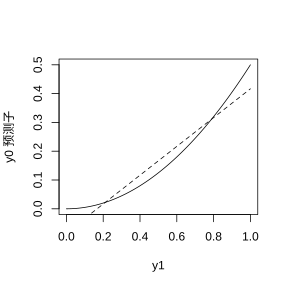

### 3.2.2 最佳均方预测误差预测子

同样，首先考虑一般情况：希望基于训练数据 $\boldsymbol{Y}_\mathrm{tr}=(Y_1,\dots,Y_n)'$ 对 $Y_0$ 进行预测。

> **定义**：若对于任意其他预测子 $Y_0^*$，均满足 $$\mathrm{MSPE}(\widehat{Y}_0,F)\leq\mathrm{MSPE}(Y_0^*,F)$$ 则称 $Y_0$ 的预测子 $\widehat{Y}_0$ 是在 $F$ 下的最小（最优）均方预测误差预测子，其中均方预测误差由式 (3.2.2) 定义。

具有实际意义的预测变量会同时使多种分布 $F$ 的均方预测误差最小化。

---

定理 3.1 是预测基本定理；该定理表明，在给定训练集观测 $\boldsymbol{Y}_{\mathrm{tr}}$ 时，$Y_0$ 的条件均值是基于 $\boldsymbol{Y}_{\mathrm{tr}}$ 得到的 $Y_0$ 的最小均方预测误差预测子（前提是下文所述矩存在）。期望符号对应的是由分布 $F$ 导出的 $(Y_0,\boldsymbol{Y}_{\mathrm{tr}})$ 的联合分布。

> **定理 3.1**：假设 $(Y_0,\boldsymbol{Y}_\mathrm{tr})$ 服从分布 $F$。那么 $$\widehat{Y}_0=\mathrm{E}[Y_0\mid \boldsymbol{Y}_\mathrm{tr}]\tag{3.2.9}$$ 是 $Y_0$ 的最优均方预测误差预测子。

**证明**

选取任意一个竞争预测子 $Y^*_0=Y^*_0(\boldsymbol{Y}_\mathrm{tr})$；于是

$$
\begin{align*}
&\quad\;\mathrm{MSPE}(Y^*_0,F)\\
&=\mathrm{E}[(Y^*_0-Y_0)^2]\\
&=\mathrm{E}[(Y^*_0-\widehat{Y}_0+\widehat{Y}_0-Y_0)^2]\\
&=\mathrm{E}[(Y^*_0-\widehat{Y}_0)^2]+\mathrm{MSPE}(\widehat{Y}_0,F)\\
&\quad\;+2\mathrm{E}[(Y^*_0-\widehat{Y}_0)(\widehat{Y}_0-Y_0)]\\
&\ge\mathrm{MSPE}(\widehat{Y}_0,F)+2\mathrm{E}[(Y^*_0-\widehat{Y}_0)(\widehat{Y}_0-Y_0)]\tag{3.2.10}\\
&=\mathrm{MSPE}(\widehat{Y}_0,F),\tag{3.2.11}
\end{align*}
$$

式 (3.2.10) 成立是因为 $\mathrm{E}[(Y^*_0-\widehat{Y}_0)^2]\ge0$。式 (3.2.11) 取等是由于

$$
\begin{aligned}
&\quad\;\mathrm{E}[(Y^*_0-\widehat{Y}_0)(\widehat{Y}_0-Y_0)]\\
&=\mathrm{E}[(Y^*_0-\widehat{Y}_0)\mathrm{E}\{\widehat{Y}_0-Y_0\mid\boldsymbol{Y}_\mathrm{tr}\}]\\
&=\mathrm{E}[(Y^*_0-\widehat{Y}_0)(\widehat{Y}_0-\mathrm{E}\{Y_0\mid\boldsymbol{Y}_\mathrm{tr}\})]\\
&=\mathrm{E}[(Y^*_0-\widehat{Y}_0)\times0]\\
&=0,
\end{aligned}
$$

证毕。

---

最优均方预测误差预测子对于所有满足式 (3.2.9) 的分布 $F$ 都必须是无偏的，这是因为

$$
\mathrm{E}[\widehat{Y_0}]=\mathrm{E}[\mathrm{E}\{Y_0\mid\boldsymbol{Y}_{\mathrm{tr}}\}]=\mathrm{E}[Y_0]
$$

因此，最优均方预测误差预测子是对最佳线性无偏预测准则的进一步强化：所考虑的预测子类别不再局限于训练数据的线性函数，而可以是任意形式。下一个例子将说明，把预测子的范围从线性函数拓展之后，均方预测误差能够得到改善。

---

**例 3.2**

假设 $(Y_0,Y_1)$ 的联合分布由密度函数

$$
f(y_0,y_1)=\begin{cases}1/y_1^2,&0<y_1<1,0<y_0<y_1^2\\
0,&\mathrm{其他}\end{cases}
$$

给出。可以直接算出，在给定 $Y_1=y_1$ 的条件下，$Y_0$ 的条件分布服从区间 $(0,y_1^2)$ 上的均匀分布。因此 $Y_0$ 的最优均方预测误差预测值为该区间的中点，即：

$$
\widehat{Y}_0=\mathrm{E}[Y_0\mid Y_1]=Y_1^2/2
$$

该预测式关于 $Y_1$ 是非线性的。

---

我们针对 $(Y_0,Y_1)$ 的同一 $f(y_0,y_1)$ 模型，对比最优均方预测误差预测子与 $Y_0$ 的最佳线性无偏预测。最佳线性无偏预测是在满足无偏性条件 $\mathrm{E}[a_0+a_1Y_1]=\mathrm{E}[Y_0]$ 的系数 $(a_0,a_1)$ 中，使 $\mathrm{E}[(a_0+a_1Y_1-Y_0)^2]$ 最小的 $a_0+a_1Y_1$。由无偏性可得约束条件：

$$
\begin{aligned}
a_0+a_1\cdot\frac12&=\frac16\\
a_0&=\frac16-a_1\cdot\frac12
\end{aligned}
$$

对均方预测误差

$$
\mathrm{E}\left[\left(\left\{\frac16-\frac{a_1}{2}\right\}+a_1Y_1-Y_0\right)^2\right]
$$

运用微积分求极小值，可解得 $a_1=1/2$，进而 $a_0=1/6-a_1/2=-1/12$，也就是 $\widehat{Y}_0^\mathrm{L}=-\frac{1}{12}+\frac12Y_1$ 为 $Y_0$ 的最佳线性无偏预测。

---

图 3.1 表明，对所有 $y_1\in(0,1)$，预测值 $\widehat{Y}_0$ 和 $\widehat{Y}_0^L$ 都十分接近。$\widehat{Y}_0$ 的均方预测误差为

$$
\begin{align*}
\mathrm{E}[(\widehat{Y}_0-Y_{1/2}^2)^2]
&=\mathrm{E}[\mathrm{E}[(Y_0-Y_{1/2}^2)^2\mid Y_1]]\\
&=\mathrm{E}[\mathrm{Var}[Y_0\mid Y_1]]\\
&=\mathrm{E}\left[\frac{Y_1^4}{12}\right]\tag{3.2.12}\\
&=\frac{1}{60}\approx0.01667
\end{align*}
$$

式 (3.2.12) 中的内层项 $\frac{Y_1^4}{12}$ 是区间 $(0,Y_1^2)$ 上均匀分布的方差。类似计算可得

$$
\mathrm{E}[(\widehat{Y}_0^\mathrm{L}-Y_0)^2]=0.01806>0.01667
$$

这与理论结论一致，但正如图 3.1 所呈现的，二者差值很小。

> **图 3.1**：对于例 3.2，预测值 $\widehat{Y}_0$（实线）和 $\widehat{Y}_0^\mathrm{L}$（虚线）关于 $y_1\in(0,1)$

{width=50%}

---

**例 3.3**

回到相关系数已知的高斯过程场景，暂且假设 $\boldsymbol{\beta}$ 与 $\sigma_Z^2$ 同样已知。那么在给定 $\boldsymbol{\beta}$、$\sigma_Z^2$ 和 $R(\cdot)$ 的条件下，$Y_\mathrm{te}=Y(\boldsymbol{x}_\mathrm{te})$ 与 $\boldsymbol{Y}_\mathrm{tr}=\{Y(\boldsymbol{x}^\mathrm{tr}_1),\dots,Y(\boldsymbol{x}^\mathrm{tr}_{n_s})\}'$ 的联合分布为多元正态分布：

$$
\begin{bmatrix}Y_\mathrm{te}\\
\boldsymbol{Y}_\mathrm{tr}\end{bmatrix}\sim\mathcal{N}_{1+n_s}\left(\begin{bmatrix}\boldsymbol{f}_\mathrm{te}'\\
\boldsymbol{F}_\mathrm{tr}\end{bmatrix}\boldsymbol{\beta},\sigma_Z^2\begin{bmatrix}1&\boldsymbol{r}_\mathrm{te}'\\
\boldsymbol{r}_\mathrm{te}&\boldsymbol{R}_\mathrm{tr}\end{bmatrix}\right)\tag{3.2.13}
$$

---

现在，假设设计矩阵 $\boldsymbol{F}_\mathrm{tr}$ 列满秩，秩为 $p$，且 $\boldsymbol{R}_\mathrm{tr}$ 正定，由定理 3.1 和 B.2 可得：

$$
\widehat{y}_\mathrm{te}=\mathrm{E}[Y_\mathrm{te}\mid\boldsymbol{Y}_\mathrm{tr}]=\boldsymbol{f}_\mathrm{te}'\boldsymbol{\beta}+\boldsymbol{r}_\mathrm{te}'\boldsymbol{R}_\mathrm{tr}^{-1}(\boldsymbol{Y}_\mathrm{tr}-\boldsymbol{F}_\mathrm{tr}\boldsymbol{\beta})
\tag{3.2.14}
$$

是 $y(\boldsymbol{x}_\mathrm{te})$ 的最优均方预测误差预测子。

---

使 (3.2.14) 成为最小均方预测误差预测子的分布族 $\mathcal{F}$ 同样少得可怜。当 $\boldsymbol{\beta}$ 或 $R(\cdot)$ 发生变化时，最优均方预测误差预测子会随之改变；但对于所有满足 $\sigma_Z^2>0$ 的情况，$\widehat{y}_{\mathrm{te}}$ 保持不变。

---

**例 3.4**

考虑回归加平稳高斯过程模型的第二个版本，其中 $\boldsymbol{\beta}$ 未知，$\sigma_Z^2$ 已知（尽管下面的计算并不需要该条件）。假设数据服从如下定义的两阶段模型。

---

将 (3.2.13) 式视作给定 $\boldsymbol{\beta}$ 时 $(Y_\mathrm{te},\boldsymbol{Y}_\mathrm{tr})$ 的条件分布，即 $[(Y_\mathrm{te},\boldsymbol{Y}_\mathrm{tr})\mid\boldsymbol{\beta}]$ 为两阶段模型的第一阶段。模型的第二阶段对 $\boldsymbol{\beta}$ 设置任意先验分布，记为 $[\boldsymbol{\beta}]$。$Y_\mathrm{te}$ 的最小均方预测误差预测量为

$$
\begin{aligned}
&\quad\;\widehat{y}_\mathrm{te}=\mathrm{E}[Y_\mathrm{te}\mid\boldsymbol{Y}_\mathrm{tr}]\\
&=\mathrm{E}[\mathrm{E}\{Y_\mathrm{te}\mid\boldsymbol{Y}_\mathrm{tr},\boldsymbol{\beta}\}\mid\boldsymbol{Y}_\mathrm{tr}]\\
&=\mathrm{E}[\boldsymbol{f}'_\mathrm{te}\boldsymbol{\beta}+\boldsymbol{r}'_\mathrm{te}\boldsymbol{R}^{-1}_\mathrm{tr}(\boldsymbol{Y}_\mathrm{tr}-\boldsymbol{F}_\mathrm{tr}\boldsymbol{\beta})\mid\boldsymbol{Y}_\mathrm{tr}]
\end{aligned}
$$

最后的期望是对给定 $\boldsymbol{Y}_\mathrm{tr}$ 下 $\boldsymbol{\beta}$ 的条件分布求取。因此

$$
\widehat{y}_\mathrm{te}=\boldsymbol{f}'_\mathrm{te}\mathrm{E}[\boldsymbol{\beta}\mid\boldsymbol{Y}_\mathrm{tr}]+\boldsymbol{r}'_\mathrm{te}\boldsymbol{R}^{-1}_\mathrm{tr}(\boldsymbol{Y}_\mathrm{tr}-\boldsymbol{F}_\mathrm{tr}\mathrm{E}[\boldsymbol{\beta}\mid\boldsymbol{Y}_\mathrm{tr}])
$$

对于任意第一阶段由式 (3.2.13) 给出、第二阶段为任意 $\boldsymbol{\beta}$ 先验且 $\mathrm{E}[\boldsymbol{\beta}\mid\boldsymbol{Y}_\mathrm{tr}]$ 存在的两阶段模型，上式即为 $Y(\boldsymbol{x}_\mathrm{te})$ 的最小均方预测误差预测量。

---

当然，$\mathrm{E}[\boldsymbol{\beta}\mid\boldsymbol{Y}_{\mathrm{tr}}]$ 的显式表达式（进而 $\widehat{y}_{\mathrm{te}}$）依赖于 $\boldsymbol{\beta}$ 的先验分布。例如，当 $\boldsymbol{\beta}$ 采用无信息先验

$$
[\boldsymbol{\beta}]\propto1
$$

通过下式可以推导条件分布 $[\boldsymbol{\beta}\mid\boldsymbol{y}_{\mathrm{tr}}]$：

$$
\begin{aligned}
&\quad\;[\boldsymbol{\beta}\mid\boldsymbol{Y}_{\mathrm{tr}}=\boldsymbol{y}_{\mathrm{tr}}]\\
&\propto[\boldsymbol{y}_{\mathrm{tr}}\mid\boldsymbol{\beta}]\times[\boldsymbol{\beta}]\\
&\propto\exp\left\{-\frac{1}{2\sigma_Z^2}(\boldsymbol{y}_{\mathrm{tr}}-\boldsymbol{F}_{\mathrm{tr}}\boldsymbol{\beta})'\boldsymbol{R}_{\mathrm{tr}}^{-1}(\boldsymbol{y}_{\mathrm{tr}}-\boldsymbol{F}_{\mathrm{tr}}\boldsymbol{\beta})\right\}\times1\\
&\propto\exp\left\{-\frac{1}{2\sigma_Z^2}(\boldsymbol{\beta}'\boldsymbol{F}_{\mathrm{tr}}'\boldsymbol{R}_{\mathrm{tr}}^{-1}\boldsymbol{F}_{\mathrm{tr}}\boldsymbol{\beta}-2\boldsymbol{\beta}'\boldsymbol{F}_{\mathrm{tr}}'\boldsymbol{R}_{\mathrm{tr}}^{-1}\boldsymbol{y}_{\mathrm{tr}})\right\}\\
&=\exp\left\{-\frac{1}{2}\boldsymbol{\beta}'\boldsymbol{A}^{-1}\boldsymbol{\beta}+\nu'\boldsymbol{\beta}\right\}
\end{aligned}
$$

其中 $\boldsymbol{A}^{-1}=\boldsymbol{F}_{\mathrm{tr}}'(\sigma_Z^2\boldsymbol{R}_{\mathrm{tr}})^{-1}\boldsymbol{F}_{\mathrm{tr}}$，$\nu=\boldsymbol{F}_{\mathrm{tr}}'(\sigma_Z^2\boldsymbol{R}_{\mathrm{tr}})^{-1}\boldsymbol{y}_{\mathrm{tr}}$。继续假定 $\boldsymbol{F}$ 列满秩 $p$，此时 $\mathrm{rank}(\boldsymbol{A})=p$。

> 若随机向量 $\boldsymbol{W}$ 具有密度函数 $f(\boldsymbol{w})$，且满足 $$f(\boldsymbol{w})\propto\exp\left\{-\frac{1}{2}\boldsymbol{w}'\boldsymbol{A}^{-1}\boldsymbol{w}+\boldsymbol{v}'\boldsymbol{w}\right\}\tag{B.1.4}$$ 则 $\boldsymbol{W}\sim\mathcal{N}_n(\boldsymbol{A}\boldsymbol{v},\boldsymbol{A})$。

利用 (B.1.4) 可得

$$
[\boldsymbol{\beta}\mid\boldsymbol{Y}_{\mathrm{tr}}]\sim\mathcal{N}_p((\boldsymbol{F}_{\mathrm{tr}}'\boldsymbol{R}_{\mathrm{tr}}^{-1}\boldsymbol{F}_{\mathrm{tr}})^{-1}\boldsymbol{F}_{\mathrm{tr}}'\boldsymbol{R}_{\mathrm{tr}}^{-1}\boldsymbol{Y}_{\mathrm{tr}},\;\sigma_Z^2(\boldsymbol{F}_{\mathrm{tr}}'\boldsymbol{R}_{\mathrm{tr}}^{-1}\boldsymbol{F}_{\mathrm{tr}})^{-1})
$$

这是因为在 $[\boldsymbol{\beta}\mid\boldsymbol{Y}_{\mathrm{tr}}]$ 的均值表达式中，$\sigma_Z^2$ 项会相互抵消。因此，在此两阶段模型下，$Y_0$ 的最小均方预测误差最优预测量为

$$
\widehat{y}_{\mathrm{te}}=\boldsymbol{f}_{\mathrm{te}}'\widehat{\boldsymbol{\beta}}+\boldsymbol{r}_{\mathrm{te}}'\boldsymbol{R}_{\mathrm{tr}}^{-1}\left(\boldsymbol{Y}_{\mathrm{tr}}-\boldsymbol{F}_{\mathrm{tr}}\widehat{\boldsymbol{\beta}}\right)
\tag{3.2.15}
$$

式中 $\widehat{\boldsymbol{\beta}}=(\boldsymbol{F}_{\mathrm{tr}}'\boldsymbol{R}_{\mathrm{tr}}^{-1}\boldsymbol{F}_{\mathrm{tr}})^{-1}\boldsymbol{F}_{\mathrm{tr}}'\boldsymbol{R}_{\mathrm{tr}}^{-1}\boldsymbol{Y}_{\mathrm{tr}}$，也就是最佳线性无偏预测量。
