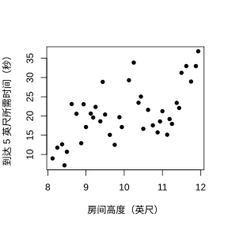
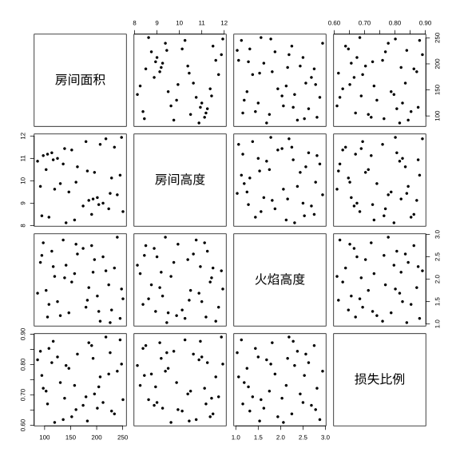
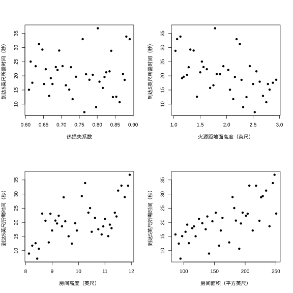
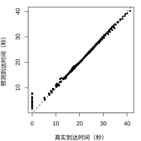

### 3.3.6 示例

**例 1.1**（密闭空间火灾的时间演化）

确定性计算机模型广泛应用于消防设计的多个领域，其中就包括疏散（出口）分析。本示例介绍早期一类“区域”计算机模型，该模型用于预测密闭房间内的火灾状态。库珀（1980）以及库珀与斯特鲁普（1985）提出了一套数学模型，并使用 FORTRAN 语言实现，用于描述门窗紧闭的单间内火灾发展过程：房间内有物体在顶棚下方某位置被引燃（萨哈马与戴蒙德（2008）对该数学模型给出了简化说明）。模型假设房间地面位置存在一处微小缝隙，避免房间内部压力持续升高。火灾会释放热量与高温燃烧产物，热量和产物的释放速率可随时间发生变化。燃烧产物形成羽流并向顶棚上升；羽流上升过程中会卷吸冷空气，使得羽流温度降低、体积流量增大。羽流抵达顶棚后向四周扩散，形成热烟气层，该烟气层的下边界会随时间不断下降。房间上部的热烟气层与下部空气之间存在较为清晰的分界面，在该模型中，房间下部空气保持常温。房间下部空气与上部热烟气层之间仅通过羽流发生物质交换。因此，这类程序所采用的模型也被称为双区域模型。

---

库珀与斯特鲁普（1985）开发的程序代码名为 ASET（可用安全疏散时间）。沃尔顿（1985）使用 BASIC 语言实现了该模型，并将其计算机代码命名为 ASET-B；开发该程序时，其设计目标是适配当时第一代个人计算机。ASET-B 是一款精简、易于运行的程序，它求解的微分方程与ASET相同，但采用了更为简便的数值方法。

---

ASET-B 的输入参数包括：

- 房间顶棚高度与房间地面面积，
- 燃烧物体（火源）距离地面的高度，
- 房间的热损失系数（例如，该系数取决于房间的保温情况），
- 材料对应的热释放速率，以及
- 模拟运行的最大时长。

该程序的输出结果为热烟气层温度及其距离火源上方的高度随时间变化的数值。

---

自这些早期研究以来，研究人员已编写计算机代码，用于模拟野火以及密闭空间内火灾的发展过程。相关研究的典型实例可参见林恩（1997）、库珀（1997）与扬森斯（2000）的文献及其参考文献。美国国家标准与技术研究院（NIST）建筑与火灾研究实验室的出版物包含大量火灾数学建模相关资料（详见网址：<http://fire.nist.gov/bfrlpubs>）。伯克等人（2002）的综述文章介绍了评估野火计算机模型的统计学方法。萨哈马与戴蒙德（2001）开展了一项案例研究，对由 ASET-B 模型计算得到的 $50$ 组观测数据进行分析。

---

为了解这些变量各自对火灾发展过程产生的影响，下文开展的模拟将热释放速率固定，对应一种构成“半通用型”火灾的可燃物。该热释放曲线对应的火灾场景为：“可燃物组包含带床单的聚氨酯床垫，以及类似木垛、托盘上的聚氨酯材料、纸包装箱堆叠在托盘上的货品”（伯克，1997）。随后采用“索博尔设计”对其余四项因子进行变动。本例的响应指标为：火焰到达燃烧可燃物组上方 $5$ 英尺处所需的时间，精确至秒。

---

绘制了各输入变量与热烟层上升至火源上方 $5$ 英尺所需时间的散点图。只有房间面积与输出量呈现显著的直观关联；图 1.1 即为该散点图。这一结论符合直观逻辑：更大的房间需要更多燃烧产物才能充盈房间上部空间，因此烟层上升至火源上方 $5$ 英尺位置需要更长时间。

> **图 1.1**：房间面积与热烟层到达火源上方 $5$ 英尺处所需时间的散点图

{width=50%}

---

各输入变量的取值范围如表 3.1 所示。

> **表 3.1**：例 1.1 中可能影响烟羽上升至火源上方 $5$ 英尺所需时间的各因素取值范围

|输入参数|下限|上限|
|:--:|:--:|:--:|
|热损失系数|$0.6$|$0.9$|
|火源高度|$1.0$|$3.0$|
|房间高度|$8.0$|1$2.0$|
|房间面积|8$1.0$|25$6.0$|

---

此前用到的索博尔序列中的同样 $40$ 个点，现在被用作预测的训练数据。实际上，这 $40$ 个四维点共有 $\binom{40}{2}$ 组点对，当缩放至 $[0,1]^4$ 空间时，其最小点间距离为 $0.22$。与之对比，一种最大化所有输入点对最小点间距离的设计（极大极小对称拉丁超立方设计）对应的该数值为 $0.41$。尽管如此，图 3.2 显示，该设计的 $40$ 个输入点存在 $\binom{4}{2}=6$ 组二维投影，从视觉上看分布较为均匀。

> **图 3.2**：示例 1.1 所用 $40$ 个输入点的散点图矩阵

{width=100%}

---

图 3.3 展示了四个输入变量各自与火焰蔓延至火源上方 $5$ 英尺所需时间的边际散点图。只有房间面积看起来与响应时间存在较强的边际相关性。

> **图 3.3**：利用例 1.1 的数据绘制火灾蔓延至火源上方 $5$ 英尺所需时间分别与各输入参数的散点图：（1）热损失系数（2）火源距地面高度（3）房间高度（4）房间面积

{width=100%}

---

假设需要在变量取值范围内，对由 $320=4\times4\times4\times5$ 个等间距点构成的 $\boldsymbol{x}$ 网格预测 $y(\boldsymbol{x})$，这四个变量依次为热损失系数、房间高度、火源高度与房间面积。考虑基于平稳高斯过程的限制极大似然经验最优线性无偏预测，该高斯过程具有常数均值 $\beta_0$、过程方差 $\sigma_Z^2$ 以及高斯相关函数：

$$
\mathrm{Cor}[Y(\boldsymbol{x}_1),Y(\boldsymbol{x}_2)]=\exp\left\{-\sum_{j=1}^{d}\xi_j(x_{1,j}-x_{2,j})^2\right\}
\tag{3.3.12}
$$

利用这些数据进行限制极大似然经验最优线性无偏预测拟合得到的结果为：$\widehat{\beta}_0=49.5666$，$\widehat{\sigma}_Z^2=397.29$，$\xi_j$ 的估计值如表 3.2 所示。由此可知，距离地面 $5$ 英尺处达到目标状态的时间大致“中间值”约为 $50$ 秒，$y(\boldsymbol{x})$ 的取值范围约为 $40$ 秒（$40\approx2\times\sqrt{397}$）。由于各输入变量的取值范围差异较大，直接解释估计得到的$\xi_j$存在困难。一种对 $\xi_j$ 进行解读的方法是通过变换将每个输入变量 $(x_{1,j},\dots,x_{n_s,j})$ 映射至区间 $[0,1]$：

$$
x^s_{i,j}=\frac{x_{i,j}-\min_{1\le i\le n_s}x_{i,j}}{r_j}
$$

其中 $r_j=\max_{1\le i\le n_s}x_{i,j}-\min_{1\le i\le n_s}x_{i,j}$ 为第 $j$ 个输入变量的取值范围。此时相关函数可写成：

$$
\mathrm{Cor}[Y(\boldsymbol{x}_1),Y(\boldsymbol{x}_2)]=\exp\left\{-\sum_{j=1}^{d}\xi_j(x_{1,j}-x_{2,j})^2\right\}=\exp\left\{-\sum_{j=1}^{d}\xi_jr_j^2(x^s_{1,j}-x^s_{2,j})^2\right\}.
$$

因此 $\exp\{-\xi_jr_j^2\}$ 代表两组输入配置 $\boldsymbol{x}_1$ 与 $\boldsymbol{x}_2$ 仅在第 $j$ 个分量不同，且该分量取到区间两端极值（即 $|x_{1,j}-x_{2,j}|=r_j$）时，对应响应时间的相关系数。已知相关系数越低，代表函数的“变化活跃度”越高。表 3.2 第四列结果表明：房间面积对 $y(\boldsymbol{x})$ 的影响遥遥领先（是最活跃的输入变量）；房间高度与火源高度的活跃度相近，但远低于房间面积；热损失系数对 $y(\boldsymbol{x})$ 的影响则非常微弱。

> **表 3.2**：式（3.3.12）中 $\xi_j$（$j=1,\dots,4$）的限制极大似然估计值，以及各输入对应的粗略灵敏度指标 $\exp(-\xi_jr_j^2)$（数值越小代表影响程度越高）

|输入变量|$\widehat{\xi}_j$|$\widehat{\xi}_jr_j^2$|$\exp\left(-\widehat{\xi}_jr_j^2\right)$|
|:--:|:--:|:--:|:--:|
|热损失系数|$0.98552$|$0.07779$|$0.92550$|
|火源高度|$0.0589$|$0.21441$|$0.80773$|
|房间高度|$0.0122$|$0.1768$|$0.8380$|
|房间面积|$0.0001$|$1.93443$|$0.14445$|

---

可采用多项指标评估 $320$ 个网格点处预测结果的质量。本研究中，在包含 $320$ 个点的测试网格上计算得到真实模拟器输出 $y(\boldsymbol{x})$。图 3.4 展示了烟羽上升至离地5英尺所需时间的真实值与预测值之间的可视化对比；在全部 $y(\boldsymbol{x})$ 取值范围内，二者吻合度良好。

> **图 3.4**：示例 1.1 中使用的 $320$ 个等距网格点，火源上方 $5$ 英尺处真实到达时间与预测到达时间的散点图

{width=50%}

---

交叉验证是一种定量方法，适用于无法像常规情况那样获得预测输出的场景。交叉验证依托训练集开展，因为每个训练样本输入对应的输出都是已知的。要得到 $y(\boldsymbol{x}_i^\mathrm{tr})$ 的交叉验证预测值，需要从训练数据中剔除样本 $\{\boldsymbol{x}_i^\mathrm{tr},y(\boldsymbol{x}_i^\mathrm{tr})\}$，利用剩余 $39$ 个样本拟合模型参数，并基于该拟合结果预测 $y(\boldsymbol{x}_i^\mathrm{tr})$。除其他诊断方法外，还可以绘制交叉验证预测值与真实值的对比图。此处计算得到这组包含 40 个样本的 $y(x)$ 训练数据的交叉验证预测均方根误差（Cross-Val RMSPE）为

$$
\text{Cross-Val RMSPE}=0.6012
$$

在本例中，同样可以对包含 320 个样本的测试网格计算预测均方根误差：

$$
\sqrt{\frac{1}{320}\sum_{i=1}^{320}\{y(\boldsymbol{x}_i^\mathrm{te})-\widehat{y}(\boldsymbol{x}_i^\mathrm{te})\}^2}=0.4217
$$

---

交叉验证均方根预测误差能够对该模型以及训练数据的预测能力给出非常充分，甚至是最坏情况下的评估。
